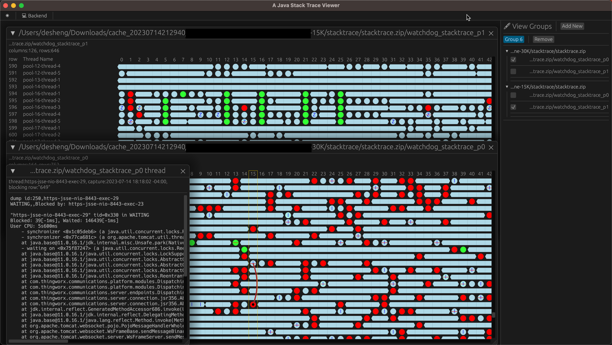

# STV - Simple Java Stack Trace Viewer for Java Performance Tuning

`stv` is a robust application designed for simple Java stack trace viewing. This Java Performance tool is particularly useful for Performance Tuning and Thread Dump analysis. It was inspired by the incredible functionality of PTC TS's `sammy`, undeniably one of the best Stack Trace analysis and Thread Dump viewing tools.

However, `sammy` discontinued its support for MacOS. As an extensive Mac user who frequently needs to analyze Java Performance issues or view various Java Stack Traces and Thread Dumps, I decided to create a tool tailored to my requirements.

## Download

To start using `stv` for your Java Stack Trace analysis and Java Performance Tuning needs, you can download the application from the [releases page](https://github.com/xudesheng/stv/releases).

## Supported File Formats

- Java Stack Traces captured by the Thingworx Support Subsystem.
- Thread Dumps captured via the Java `jstack` command, an essential tool for Java Performance Tuning.
- Outputs from the `kill -3` command, even those intermixed with other logs, useful in Java Performance analysis.
- All aforementioned file formats in either **zip** or **tar.gz**.

## Future Developments

- [ ] Incorporation of Server Side Deployment and result viewing in-browser via WASM, enhancing the Java Performance Tuning process.
- [ ] Live monitoring of Java Stack Trace files.
- [ ] Synchronized scrolling across multiple Thread Dump files for unified timestamp navigation.
- [ ] **Self-defined rules** support, adding flexibility to your Java Performance Tuning process.
- [ ] Customizable color schemes.

## Usage

Usage is straightforward: Simply drag and drop the Thread Dump file(s) (either in plain text, zip, or tar.gz format) into the tool. 

- All files within the same group can be displayed simultaneously. You simply need to select the file.
- Click the `Add New` button to create additional groups.
- Only the threads within the selected group will be displayed.
- Upon selecting a blocked thread, a line leading to the blocking thread will appear (if one exists).

## Issues or Enhancement Requests

Feel free to utilize the issue page to submit any problems you encounter or to propose potential enhancements.

## Open Source

This tool has been developed purely using the Rust language, suitable for those dealing with Java Stack Traces and Java Performance issues. Please note that the code isn't currently ready for public access.
